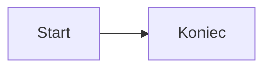

<!-- fixture: synthetic, CC0; categories: signs-uszkodzony-markdown, signs-przypis-bez-zakresu, kontrcytat-z-klisza -->

## Sekcja

Tekst z [linkiem](https://example.test/path) i `inline_code()`.[^1]

> „To nie jest błąd. To sygnał.”

| Pole | Wartość |
| --- | --- |
| status | `OK` |


```python
print("Nie zmieniaj tego")
```



<!-- Nie redaguj tego komentarza. -->

[^1]: Przypis testowy.
